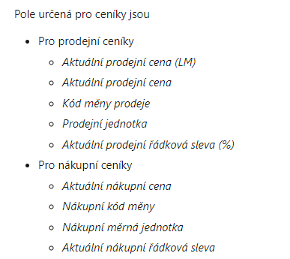
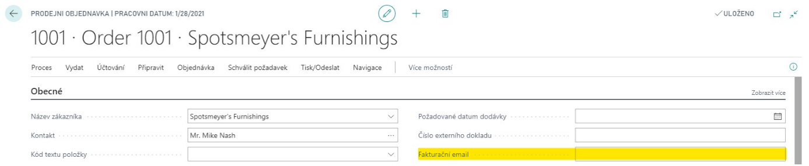

!#-

#### Historie 
| Verze   | Popis změny | Datum      |
| ------- | ----------- | ---------- |
| 1.0.0.0 | První verze | 01.01.2000 |

-#!

## Obecný popis

## Nastavení

> konec sablony
---

## Jak psat dokumentace

[Dokumentace Markdown](https://docs.microsoft.com/en-us/azure/devops/project/wiki/markdown-guidance?view=azure-devops)

### Metadata

Hlavni soubor `documentation.md` (nebo `index.md`) musi zacinat nasledujici sekci:
```
---
name: nazev extensiony bez uvedení kódu ext (tedy bez AEXXX). Pokud se jedná o zákaznickou ext., uvádějte název zákazníka 
description: kratky popis max 10 slov. Bude se zobrazovat zákazníkovi! 
code: AEXXX nebo CU-zakaznik-xxx 
---
```

Dalsi md soubory v dokumentaci musi obsahovat pouze:
```
---
filename: Popis souboru pro zobrazeni v leve casti dokumentace
order: poradi souboru (integer)
---
```

### Format historie

```
#### Historie 
| Verze   | Popis změny | Datum      |
| ------- | ----------- | ---------- |
| 1.0.0.0 | První verze | 01.01.2000 |
```

Sekce historie je ohranicena znaky `!#-` `-#!`. Takto ohranicena sekce kdekoliv v dokumentaci nebude vykreslena na zakaznickem portalu.

#### Priklad

```
Tato veta je zobrazena!#- bez teto casti-#!.
```

Tato veta je zobrazena!#- bez teto casti-#!.

### Generovani permission setu
- Ke kazde uprave je nutne po nainstalovani vygenerovat permission sety na zobrazeni, editaci a setup
- Permissiony umistit do slozky Permissions v rootu extensiony
- Syntaxe techto permission setu je KODUPRAVY VIEW/EDIT/SETUP. Napriklad tedy:
    - AE032 VIEW
    - AE032 EDIT
    - AE032 SETUP
- Generovani permission setu je pres "permissionset". ID objektu vam prideli ALRM
- Priklad z base app:
```
permissionset 4592 "HR-SETUP"
{
    Assignable = true;
    Caption = 'Human Resources setup';
    Permissions = tabledata "Cause of Absence" = RIMD,
                  tabledata "Cause of Inactivity" = RIMD,
                  tabledata Confidential = RIMD,
                  tabledata Employee = R,
                  tabledata "Employee Absence" = R,
....
}
```
- Specificka nastaveni (napriklad pravo na otevreni urcite page, pravo k editaci specifickych zaznamu apod.) davat do "Nastaveni uzivatelu" - nezapomente v dokumentaci k cemu slouzi
### Obecna pravidla

- Vždy začínat sekcí „Obecný popis“. V této sekci popište, k čemu úprava slouží
- Uvádějte vždy sekci „Nastavení“. Pokud není úpravu nutné nastavovat, zmiňte to v této sekci
- Pokud zpracováváte velkou dokumentaci, používejte podkapitoly
- Pokud přidáváte nová pole, sepisujte se je do odrážek:
    
- Názvy nových polí a stranek kurzívou
- Obrázky používejte s rozmyslem – důležité je popsat, jak úprava funguje než nakopírovat spousty nic neříkajících obrázků. Pokud přidávám pole, stačí napsat v jaké záložce/ skupině se nachází, název a k čemu slouží, nedávat kvůli tomu obrázek.
    - Kde dávat obrázky
        - Layouty – když je to naše sestava
        - Naše nastavovací formuláře atd.
    - Kde je nedávat
        - Přidání funkce
        - Přidání pole
        - Přidání záložky
        - Request page - přidání například jednoho pole do request page zaúčtované faktury
        - Obrázek baseapp, na který není žádná úprava – například screenshot položky fronty úloh
- Pokud potřebujete na obrázku něco vyznačit, použijte buď rámeček nebo rovné označení:
    
- Dokumentace se píše pro uživatele, ne pro programátora. Nepoužívejte termíny jako „codeunit“ apod. Dokumentaci musí pochopit i netechnicky zaměřený člově
- V AE extensionách nesepisovat změněné úpravy jako zvlášní bod. Vždy zapracovat do dokumentace tak, aby byla odpovídala současnému stavu extensiony


### Zákaznické úpravy
- Vytvářet níže uvedenou strukturu:
    ```
    ## Finance
    ## Prodej a marketing
    ## Nákup a závazky
    ## Sklad
    ## Výroba
    ## Projekty
    ## Plánování zdrojů
    ## Lidské zdroje
    ## Správa (administrace)
    ```
- Úpravy sepisovat do sekcí, kterých se týkají
- Uvádět číslo ticketu ve formatu `([73566](https://helpdesk.artex-is.cz/helpdesk/tickets/73566))`
